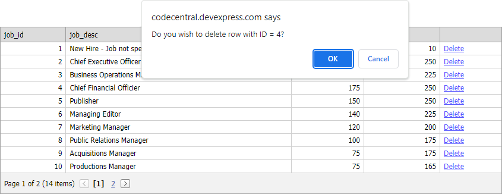

<!-- default badges list -->
[](https://supportcenter.devexpress.com/ticket/details/E131)
[](https://docs.devexpress.com/GeneralInformation/403183)
<!-- default badges end -->

# Grid View for ASP.NET Web Forms - How to include a row key value into the delete confirmation dialog
<!-- run online -->
**[[Run Online]](https://codecentral.devexpress.com/e131/)**
<!-- run online end -->

This example demonstrates how to include a row key value into the delete confirmation dialog.



## Implementation Details

In this example, [DataItemTemplate](https://docs.devexpress.com/AspNet/DevExpress.Web.GridViewDataColumn.DataItemTemplate) contains a link element. 

```aspx
<dxwgv:GridViewDataTextColumn Name="Delete" >
    <DataItemTemplate>
        <a id="DeleteButton" href="javascript:OnLinkClick(<%# Container.KeyValue.ToString()%>, <%# Container.VisibleIndex.ToString()%>);">Delete</a>
    </DataItemTemplate>
</dxwgv:GridViewDataTextColumn>
```

When a user clicks the link, the `OnLinkClick` function displays a confirmation dialog with the row key value.

```js
function OnLinkClick(id, visibleIndex) {
    if (confirm('Do you wish to delete row with ID = ' + id + '?'))
        ASPxGridView1.DeleteRow(visibleIndex);
}
```

## Files to Review

* [Default.aspx](./CS/WebSite/Default.aspx) (VB: [Default.aspx](./VB/WebSite/Default.aspx))

## More Examples

* [Grid View for ASP.NET Web Forms - How to implement a delete confirmation dialog with a "don't ask me again" option](https://github.com/DevExpress-Examples/asp-net-web-forms-grid-delete-confirm-dialog-with-dont-ask-me-again-option)
